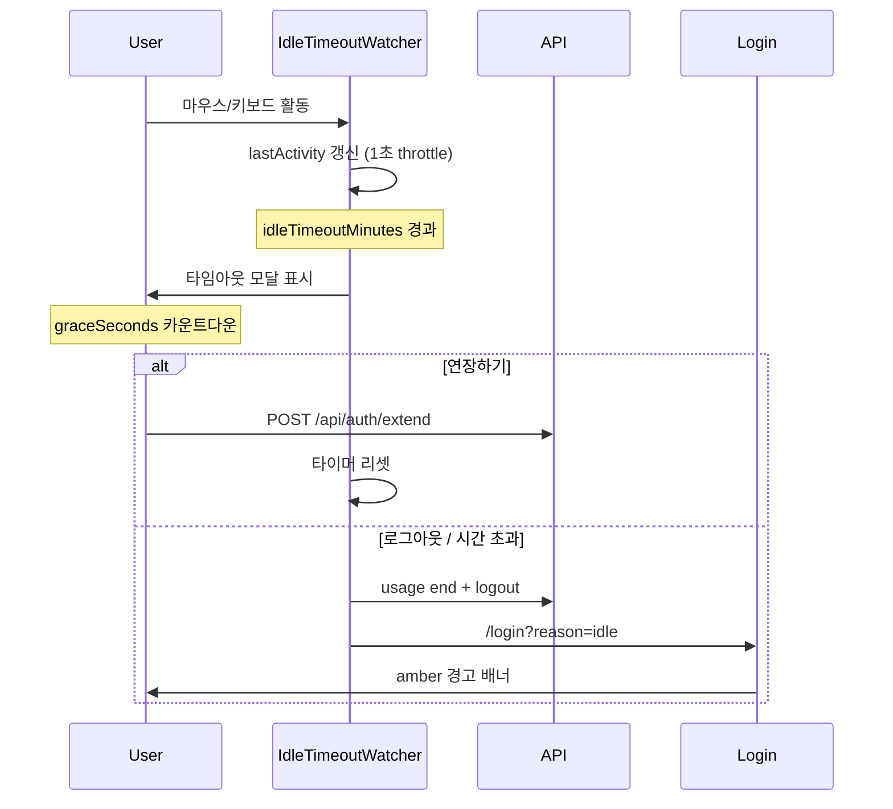

# 입찰 · 견적 시스템 UI/UX 가이드

> 다른 프로그램 개발 시 참조할 수 있도록, 현재 프로젝트에서 사용 중인 UI/UX 패턴을 정리한 문서입니다.  
> 기준 코드: `src/` (2026년 7월 기준)

**관련 문서**: GitHub · Supabase · 인증 · 배포 · API 구조는 [인프라-아키텍처-가이드.md](./인프라-아키텍처-가이드.md)를 참고하세요.

---

## 목차

1. [개요](#1-개요)
2. [디자인 시스템](#2-디자인-시스템)
3. [레이아웃 구조](#3-레이아웃-구조)
4. [내비게이션](#4-내비게이션)
5. [페이지 패턴](#5-페이지-패턴)
6. [폼 · 버튼 · 피드백](#6-폼--버튼--피드백)
7. [테이블 · 카드 · 모달](#7-테이블--카드--모달)
8. [관리자 UI](#8-관리자-ui)
9. [세션 타임아웃 UX](#9-세션-타임아웃-ux)
10. [사용 현황(Usage) UX](#10-사용-현황usage-ux)
11. [주요 사용자 흐름](#11-주요-사용자-흐름)
12. [파일 · 컴포넌트 구조](#12-파일--컴포넌트-구조)
13. [다른 프로젝트에 적용할 패턴](#13-다른-프로젝트에-적용할-패턴)

---

## 1. 개요

### 기술 스택

| 항목 | 선택 |
|------|------|
| 프레임워크 | Next.js 16 (App Router), React 19 |
| 스타일링 | Tailwind CSS v4 (`@import "tailwindcss"`) |
| UI 라이브러리 | **없음** (shadcn/ui, Radix 등 미사용) |
| 폰트 | Noto Sans KR + `"Malgun Gothic"` fallback |
| 언어 | **한국어 우선** UI (라벨, 메시지, 날짜 포맷) |

### 설계 철학

- **얇은 페이지 + 두꺼운 컴포넌트**: 라우트 파일은 제목·설명만, 실제 UI는 `src/components/`에 분리
- **Tailwind 유틸리티 직접 사용**: 공통 컴포넌트 라이브러리 없이, 반복되는 클래스 조합을 컨벤션으로 유지
- **엔터프라이즈 B2B 톤**: 네이비 브랜드 컬러, 흰색 카드 패널, slate 중립색, 정보 밀도 높은 테이블
- **접근성 기본**: `role="alertdialog"`, `aria-*` 속성, 시맨틱 HTML (label, table thead/tbody)

---

## 2. 디자인 시스템

### 2.1 브랜드 컬러

`src/app/globals.css`에 CSS 변수로 정의:

| 토큰 | HEX | 용도 |
|------|-----|------|
| `--brand-navy` | `#004b87` | 페이지 제목, Primary 버튼, 관리자 활성 상태 |
| Navy hover | `#003a6b` / `#003a6a` | Primary 버튼 hover |
| `--brand-blue` | `#009ada` | 포커스 링, 링크, hover 강조 |
| `--brand-green` | `#a4ce39` | 로그인 배경 그라데이션 악센트 |
| Sidebar bg | `#0F2645` | 좌측 고정 사이드바 |
| Sidebar accent | `#1E5FD4` | 사이드바 활성 표시, 아바타 |
| Dashboard bg | `#F5F6F8` | 대시보드 메인 영역 |
| `--background` | `#f1f5f9` | 전역 body 배경 |

### 2.2 타이포그래피

| 요소 | 클래스 |
|------|--------|
| 페이지 제목 (H1) | `text-2xl font-bold text-[#004b87]` |
| 페이지 부제 | `mt-2 text-sm text-slate-600` |
| 카드 섹션 제목 | `text-sm font-semibold text-slate-800` |
| 카드 설명 | `text-xs text-slate-500` |
| 사이드바 메뉴 | `text-[13px]` |
| 사이드바 섹션 라벨 | `text-[10px] uppercase tracking-[0.08em]` |
| 테이블 헤더 | `text-xs uppercase tracking-wide text-slate-500` |
| 테이블 본문 | `text-sm` |

### 2.3 간격 · 크기

| 요소 | 값 |
|------|-----|
| 사이드바 너비 | `220px` (고정) |
| 메인 콘텐츠 좌측 여백 | `ml-[220px]` |
| 메인 패딩 | `p-7` |
| 카드 헤더 | `px-5 py-4` |
| 카드 본문 | `px-5 py-5` |
| 폼 필드 간격 | `space-y-4` ~ `space-y-5` |
| 서브 내비 ↔ 콘텐츠 | `gap-6` |
| 앱 최대 너비 | `--max-width-app: 104.54rem` |
| 상세 모달 최대 너비 | `--max-width-detail-modal: 61rem` |

### 2.4 상태 색상 (피드백)

| 상태 | 배경 | 텍스트 | 예시 클래스 |
|------|------|--------|-------------|
| 오류 | red-50 | red-600 | `rounded-lg bg-red-50 px-4 py-3 text-sm text-red-600` |
| 성공 | emerald-50 | emerald-700 | `rounded-lg bg-emerald-50 px-4 py-3 text-sm text-emerald-700` |
| 경고 | amber-50 | amber-800 | `rounded-lg bg-amber-50 px-3 py-2 text-sm text-amber-800` |
| 로딩 | — | slate-500 | `text-sm text-slate-500` ("불러오는 중...", "저장 중...") |

### 2.5 상태 배지 (Pill)

```tsx
// 역할: 관리자
<span className="rounded-full bg-sky-50 px-2 py-0.5 text-xs text-[#004b87]">관리자</span>

// 역할: 일반
<span className="rounded-full bg-slate-100 px-2 py-0.5 text-xs text-slate-600">일반</span>

// 활성
<span className="rounded-full bg-emerald-50 px-2.5 py-0.5 text-xs font-medium text-emerald-700">활성</span>

// 비활성
<span className="rounded-full bg-red-50 px-2.5 py-0.5 text-xs font-medium text-red-600">비활성</span>
```

### 2.6 날짜 · 숫자 포맷

항상 한국 로케일 사용:

```tsx
new Date(iso).toLocaleString("ko-KR", {
  year: "numeric", month: "2-digit", day: "2-digit",
  hour: "2-digit", minute: "2-digit",
});

count.toLocaleString("ko-KR");
```

---

## 3. 레이아웃 구조

### 3.1 전체 구조

```
┌──────────────────────────────────────────────────────────────┐
│  고정 사이드바 (220px, #0F2645)  │  메인 영역 (#F5F6F8)      │
│  ┌─────────────────────────┐    │  p-7                       │
│  │ SOOSAN 로고              │    │  ┌──────────────────────┐ │
│  │ 입찰·견적 관리 시스템       │    │  │ 페이지 제목 + 부제     │ │
│  ├─────────────────────────┤    │  │ (선택) 서브 내비       │ │
│  │ 메뉴 (이모지 + 라벨)      │    │  │ 기능 컴포넌트         │ │
│  │  📊 대시보드              │    │  └──────────────────────┘ │
│  │  📢 입찰공고 조회          │    │                            │
│  │  ...                     │    │                            │
│  ├─────────────────────────┤    │                            │
│  │ 👤 사용자 정보 + 로그아웃  │    │                            │
│  └─────────────────────────┘    │                            │
└──────────────────────────────────────────────────────────────┘
```

- **상단 헤더 없음**: 내비게이션·로그아웃은 사이드바에 통합
- **전역 감시 컴포넌트**: `UsageTracker`, `IdleTimeoutWatcher`는 레이아웃에 마운트 (UI 없음)

### 3.2 대시보드 레이아웃

파일: `src/app/dashboard/layout.tsx`

```tsx
<div className="min-h-screen bg-[#F5F6F8]">
  <UsageTracker />
  <IdleTimeoutWatcher />
  <AppSidebar user={user} />
  <main className="ml-[220px] min-h-screen flex-1 p-7">{children}</main>
</div>
```

- 서버 컴포넌트에서 세션 확인 → 미인증 시 `/login` 리다이렉트

### 3.3 섹션 레이아웃 (관리자 · 공고 · 개찰결과)

2단 구조: **좌측 서브 내비 + 우측 콘텐츠**

```tsx
<div className="flex flex-col gap-6 sm:flex-row">
  <AdminSubNav />  {/* sm:w-48 */}
  <div className="min-w-0 flex-1">{children}</div>
</div>
```

- 모바일: 서브 내비가 가로 pill 형태 (`flex-row gap-2`)
- 데스크톱: 세로 스택 (`sm:flex-col sm:gap-1`)

### 3.4 로그인 레이아웃

파일: `src/app/login/page.tsx`

- 전체 화면 중앙 정렬 (`min-h-full flex items-center justify-center`)
- 배경: `bg-slate-100` + 브랜드 radial gradient 오버레이
- 카드형 로그인 폼 (`max-w-md`, `rounded-2xl`, `shadow-lg`)

---

## 4. 내비게이션

### 4.1 중앙 설정

파일: `src/lib/nav.ts`

```ts
export interface NavItem {
  href: string;
  label: string;
  adminOnly?: boolean;
}
```

- `mainNavItems`: 사이드바 1차 메뉴
- `adminSubNavItems`, `announcementsSubNavItems`, `openingResultsSubNavItems`: 섹션별 2차 메뉴
- `adminOnly: true` → 관리자 역할만 표시

### 4.2 사이드바 (`AppSidebar`)

| 상태 | 스타일 |
|------|--------|
| 활성 | 좌측 3px `#1E5FD4` 바 + `bg-[#1E5FD4]/25 text-white font-medium` |
| 비활성 | `text-white/65 hover:bg-white/6 hover:text-white` |
| 아이콘 | 이모지 (📊, 📢, ⚙️ 등) |

**활성 경로 판별**: 그룹 라우트 prefix 매칭 (예: `/dashboard/announcements` → favorites, assigned-notices 포함)

**하단 사용자 영역**:
- 원형 아바타 (이름 첫 글자, `#1E5FD4` 배경)
- 이름 + `부서 · 아이디`
- 전체 너비 로그아웃 버튼

### 4.3 서브 내비 패턴

파일: `src/components/admin-sub-nav.tsx` (동일 패턴: `announcements-sub-nav`, `opening-results-sub-nav`)

| 상태 | 스타일 |
|------|--------|
| 활성 | `bg-[#004b87] text-white rounded-lg px-3 py-2` |
| 비활성 | `text-slate-600 hover:bg-slate-100` |
| 섹션 라벨 | `text-xs font-semibold tracking-wide text-slate-400 uppercase` |

### 4.4 관리자 허브 (카드 그리드)

`/dashboard/admin` — 2열 카드 그리드로 하위 기능 안내

```tsx
<Link className="rounded-xl border border-slate-200 bg-white p-6 shadow-sm
  transition hover:border-[#009ada]/40 hover:shadow-md">
  <h2 className="font-semibold text-[#004b87]">{title}</h2>
  <p className="mt-2 text-sm text-slate-500">{description}</p>
</Link>
```

---

## 5. 페이지 패턴

### 5.1 표준 페이지 셸

거의 모든 대시보드 페이지가 동일한 헤더 구조:

```tsx
<div>
  <div className="mb-6">
    <h1 className="text-2xl font-bold text-[#004b87]">페이지 제목</h1>
    <p className="mt-2 text-sm text-slate-600">페이지 설명</p>
  </div>
  <FeatureComponent />
</div>
```

예: `src/app/dashboard/admin/session-settings/page.tsx`

### 5.2 얇은 페이지 + 기능 컴포넌트

| 역할 | 위치 | 책임 |
|------|------|------|
| Page (Server) | `src/app/dashboard/**/page.tsx` | 제목, 설명, 컴포넌트 import |
| Feature (Client) | `src/components/*.tsx` | 상태, fetch, UI 전체 |

---

## 6. 폼 · 버튼 · 피드백

### 6.1 입력 필드

```tsx
<input
  className="w-full rounded-lg border border-slate-300 px-3 py-2 text-sm outline-none
    focus:border-[#009ada] focus:ring-2 focus:ring-[#009ada]/20
    disabled:bg-slate-50 disabled:text-slate-400"
/>
```

- 라벨: `mb-1.5 block text-sm font-medium text-slate-700`
- placeholder로 입력 예시 제공

### 6.2 버튼 계층

| 유형 | 클래스 |
|------|--------|
| Primary | `rounded-lg bg-[#004b87] px-4 py-2.5 text-sm font-medium text-white hover:bg-[#003a6b] disabled:opacity-60` |
| Secondary | `rounded-lg border border-slate-300 px-4 py-2.5 text-sm text-slate-600 hover:bg-slate-100` |
| Destructive | `rounded-md border border-red-200 px-3 py-1.5 text-xs text-red-600 hover:bg-red-50` |
| Text/Link | `text-sm text-[#009ada] hover:underline` |
| Sidebar logout | `rounded-md border border-white/15 px-3 py-1.5 text-xs text-white/80 hover:bg-white/10` |

### 6.3 폼 상태 관리 패턴

외부 폼 라이브러리 없이, 다음 상태 4종을 표준으로 사용:

```tsx
const [isLoading, setIsLoading] = useState(true);
const [isSaving, setIsSaving] = useState(false);
const [error, setError] = useState("");
const [info, setInfo] = useState("");  // 성공 메시지
```

**검증 흐름**:
1. 클라이언트: trim, 숫자 범위, 필수값
2. `fetch` → 서버 JSON `{ error?: string }` 파싱
3. 오류/성공 배너 표시

**삭제 확인**: 네이티브 `confirm()` 사용

---

## 7. 테이블 · 카드 · 모달

### 7.1 카드 패널 (가장 많이 쓰이는 컨테이너)

```tsx
<div className="rounded-xl border border-slate-200 bg-white shadow-sm">
  <div className="border-b border-slate-100 px-5 py-4">
    <h2 className="text-sm font-semibold text-slate-800">섹션 제목</h2>
    <p className="mt-1 text-xs text-slate-500">설명</p>
  </div>
  <div className="px-5 py-5">{/* 내용 */}</div>
</div>
```

### 7.2 데이터 테이블

```tsx
<div className="overflow-x-auto">
  <table className="min-w-full text-left text-sm">
    <thead className="bg-slate-50 text-xs uppercase tracking-wide text-slate-500">
      <tr>
        <th className="px-5 py-3 font-medium">컬럼</th>
      </tr>
    </thead>
    <tbody className="divide-y divide-slate-100">
      <tr className="hover:bg-slate-50/80">
        <td className="px-5 py-3">...</td>
      </tr>
    </tbody>
  </table>
</div>
```

**확장 가능 행 (드릴다운)**: `UsageAnalytics`에서 "상세/접기" 버튼 → `colSpan` 행으로 중첩 테이블 표시

### 7.3 모달

```tsx
<div className="fixed inset-0 z-50 flex items-center justify-center bg-black/40 p-4">
  <div className="w-full max-w-md rounded-2xl bg-white p-6 shadow-xl">
    <h2 className="text-lg font-bold text-[#004b87]">모달 제목</h2>
    {/* 폼 또는 내용 */}
    <div className="mt-6 flex justify-end gap-2">
      <button>취소</button>
      <button>저장</button>
    </div>
  </div>
</div>
```

- 상세 모달(입찰공고 등): `detail-modal-backdrop-in`, `detail-modal-panel-in` 애니메이션 클래스 사용
- 세션 타임아웃 모달: `z-[100]`, `role="alertdialog"`, 바깥 클릭으로 닫히지 않음

---

## 8. 관리자 UI

### 8.1 CRUD 화면 공통 패턴

대표: `AccountManagement`, `DepartmentManagement`, `CrawlSiteManagement`

```
┌─────────────────────────────────────────┐
│ [오류 배너]                              │
├─────────────────────────────────────────┤
│ 툴바: N건 · [추가] / [검색] [필터]       │
├─────────────────────────────────────────┤
│ ┌─────────────────────────────────────┐ │
│ │ 테이블 (상태 배지, 행 hover, 작업 버튼) │ │
│ └─────────────────────────────────────┘ │
└─────────────────────────────────────────┘
         ↓ "추가" / "수정" 클릭
┌─────────────────────────────────────────┐
│ 모달 폼 (생성/수정)                       │
└─────────────────────────────────────────┘
```

- **인라인 편집**: 부서, 키워드 (테이블 행 내 직접 수정)
- **모달 편집**: 사용자, 크롤 사이트

### 8.2 세션 설정 (`SessionTimeoutSettings`)

| UI 요소 | 설명 |
|---------|------|
| 체크박스 | "미사용 타임아웃 사용" on/off |
| 숫자 입력 | 1~1440분 (0 = 비활성) |
| 저장 버튼 | Primary |
| 성공 메시지 | emerald 배너 + 동작 설명 (grace period 포함) |

### 8.3 사용 현황 (`UsageAnalytics`)

| UI 요소 | 설명 |
|---------|------|
| 검색 | 아이디·이름·부서 필터 |
| 새로고침 | Secondary 버튼 |
| 요약 테이블 | 아이디, 이름, 부서, 역할, 최종 접속, 최근 활동, 사용시간, 세션 수, 방문 화면 수 |
| 상세 확장 | 화면별 방문 횟수 중첩 테이블 |
| 차트 | **없음** (테이블 중심) |

---

## 9. 세션 타임아웃 UX

### 9.1 구성 요소

| 컴포넌트 | 역할 |
|----------|------|
| `SessionTimeoutSettings` | 관리자 설정 UI |
| `IdleTimeoutWatcher` | 클라이언트 유휴 감시 + 경고 모달 |
| `LoginForm` | idle 로그아웃 후 amber 경고 배너 |

### 9.2 사용자 흐름



### 9.3 UX 규칙

| 규칙 | 설명 |
|------|------|
| 활동 이벤트 | mousemove, mousedown, keydown, scroll, touchstart, click, wheel |
| 경고 중 활동 무시 | 사용자가 **연장하기**를 명시적으로 눌러야 함 |
| Grace period | 기본 60초 (`graceSeconds`), navy 텍스트로 카운트다운 표시 |
| 설정 핫 리로드 | 탭 visibility 변경 시 설정 재조회 |
| 접근성 | `role="alertdialog"`, `aria-labelledby`, `aria-describedby` |

### 9.4 타임아웃 모달 UI

```
┌─────────────────────────────────────┐
│  세션 타임아웃                        │
│                                     │
│  일정 시간 동안 사용이 없어           │
│  세션이 만료되었습니다.               │
│  계속 사용하려면 연장하기를 눌러 주세요.│
│                                     │
│  42초 후 자동으로 로그아웃됩니다.      │
│                                     │
│              [로그아웃]  [연장하기]   │
└─────────────────────────────────────┘
```

---

## 10. 사용 현황(Usage) UX

### 10.1 수집 (`UsageTracker`)

- **UI 없음** (`return null`)
- 대시보드 레이아웃에 전역 마운트
- `pathname` 변경 시 pageview 전송
- 30초 heartbeat (탭 visible일 때)
- `pagehide` / 로그아웃 시 session end

### 10.2 화면 매핑

파일: `src/lib/usage-screens.ts` — URL prefix → 한국어 화면 라벨

### 10.3 로그아웃 연동

`LogoutButton`, `IdleTimeoutWatcher` 모두 usage session 종료 후 auth logout 수행

---

## 11. 주요 사용자 흐름

### Flow A: 로그인

1. `/login` — 중앙 카드, SOOSAN 로고
2. 아이디 · 비밀번호 입력
3. 성공 → `from` 쿼리 또는 `/dashboard`
4. idle 로그아웃 시 → amber 배너 "미사용 시간이 초과되어 로그아웃되었습니다."

### Flow B: 대시보드 이용

1. 사이드바 + KPI/캘린더/테이블 (역할별 메뉴)
2. 백그라운드 usage 추적
3. 유휴 시 타임아웃 모달

### Flow C: 관리자 → 세션 설정

1. 사이드바 "관리자메뉴" → 서브 내비 "세션 설정"
2. 타임아웃 on/off + 분 단위 입력 → 저장
3. emerald 성공 배너

### Flow D: 관리자 → 사용 현황

1. 서브 내비 "사용 현황"
2. 검색 · 새로고침
3. 행 "상세" 클릭 → 화면별 방문 내역

### Flow E: 관리자 CRUD (사용자 예)

1. 툴바 "사용자 추가" → 모달
2. 테이블 행 "수정" / "삭제"
3. 삭제 시 `confirm()` → API 호출 → 목록 갱신

---

## 12. 파일 · 컴포넌트 구조

```
src/
├── app/
│   ├── globals.css              # 디자인 토큰, 애니메이션
│   ├── layout.tsx               # Noto Sans KR, lang="ko"
│   ├── login/page.tsx           # 로그인 페이지
│   └── dashboard/
│       ├── layout.tsx           # 사이드바 + 전역 watcher
│       ├── page.tsx             # 대시보드 홈
│       └── admin/
│           ├── layout.tsx       # AdminSubNav + admin gate
│           ├── page.tsx         # 관리자 허브 (카드 그리드)
│           ├── session-settings/page.tsx
│           └── usage/page.tsx
├── components/
│   ├── app-sidebar.tsx          # 메인 사이드바
│   ├── admin-sub-nav.tsx        # 관리자 서브 내비
│   ├── login-form.tsx
│   ├── logout-button.tsx
│   ├── idle-timeout-watcher.tsx
│   ├── session-timeout-settings.tsx
│   ├── usage-tracker.tsx
│   ├── usage-analytics.tsx
│   └── account-management.tsx   # CRUD 참조 구현
└── lib/
    ├── nav.ts                   # 내비게이션 설정
    ├── usage-screens.ts         # 화면 라벨 매핑
    └── app-settings-types.ts    # 세션 설정 타입
```

### 네이밍 규칙

| 규칙 | 예 |
|------|-----|
| 파일 | kebab-case (`session-timeout-settings.tsx`) |
| export | PascalCase (`SessionTimeoutSettings`) |
| 도메인 접두사 | `bid-`, `order-report-`, `usage-`, `session-` |
| 서브 내비 | `{section}-sub-nav.tsx` |

---

## 13. 다른 프로젝트에 적용할 패턴

### ✅ 권장 패턴

1. **중앙 nav 설정** — 라벨·경로·권한을 한 파일에서 관리 (`nav.ts`)
2. **페이지 셸 표준화** — navy H1 + slate 부제를 모든 페이지에 통일
3. **카드 패널** — `rounded-xl border border-slate-200 bg-white shadow-sm` + header/body 분리
4. **서브 내비 템플릿** — `flex flex-col gap-6 sm:flex-row` + `min-w-0 flex-1`
5. **fetch + 로컬 상태 CRUD** — isLoading/isSaving/error/info 4종 상태
6. **시맨틱 피드백 색** — red/emerald/amber 배너
7. **브랜드 포커스** — `focus:border-[#009ada] focus:ring-2 focus:ring-[#009ada]/20`
8. **투명 cross-cutting 클라이언트** — tracker/watcher를 layout에 마운트
9. **세션 타임아웃 UX** — 경고 모달 + 명시적 연장 + 카운트다운 + 경고 중 활동 무시
10. **확장 가능 테이블 행** — 네비게이션 없이 드릴다운
11. **한국어 로케일** — 날짜·숫자 포맷 통일

### ⚠️ 알려진 한계 · 불일치

| 항목 | 설명 |
|------|------|
| 디자인 시스템 패키지 없음 | Tailwind 클래스가 파일마다 복사됨 — 추출 시 수동 정리 필요 |
| 레거시 미사용 | `AppHeader`, `AppNav` (구 horizontal nav) |
| 사이드바 이모지 | 엔터프라이즈 톤 대비 캐주얼 — SVG 아이콘으로 교체 가능 |
| 대시보드 홈 vs 관리자 | 홈은 KPI·캘린더·커스텀 hex 배지 등 더 풍부, 관리자는 테이블 중심 |
| confirm() | 삭제 확인에 네이티브 다이얼로그 사용 — 커스텀 모달로 개선 여지 |

---

## 부록: 빠른 복사용 Tailwind 스니펫

### Primary Button
```
rounded-lg bg-[#004b87] px-4 py-2.5 text-sm font-medium text-white transition hover:bg-[#003a6b] disabled:opacity-60
```

### Text Input
```
w-full rounded-lg border border-slate-300 px-3 py-2 text-sm outline-none focus:border-[#009ada] focus:ring-2 focus:ring-[#009ada]/20
```

### Error Banner
```
rounded-lg bg-red-50 px-4 py-3 text-sm text-red-600
```

### Success Banner
```
rounded-lg bg-emerald-50 px-4 py-3 text-sm text-emerald-700
```

### Card Panel
```
rounded-xl border border-slate-200 bg-white shadow-sm
```

### Page Title
```
text-2xl font-bold text-[#004b87]
```

---

*문서 버전: 2026-07-21 · 프로젝트: SOOSAN 입찰 · 견적 시스템*
