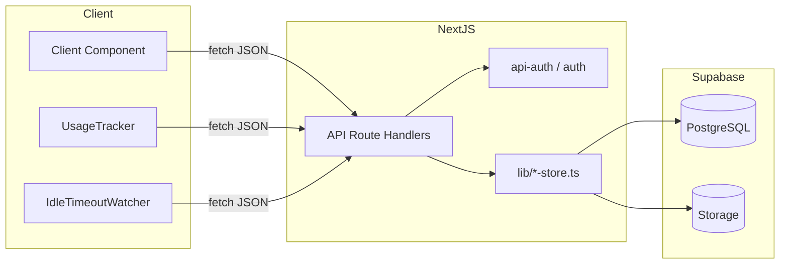

# 입찰 · 견적 시스템 — 인프라 · DB · GitHub 참조 가이드

> 다른 프로그램 개발 시 참조할 수 있도록, 저장소·배포·데이터베이스·인증·API 구조를 정리한 문서입니다.  
> UI/UX 패턴은 [UI-UX-가이드.md](./UI-UX-가이드.md)를 함께 참고하세요.

---

## 목차

1. [전체 아키텍처](#1-전체-아키텍처)
2. [GitHub · 저장소 관리](#2-github--저장소-관리)
3. [배포 파이프라인](#3-배포-파이프라인)
4. [환경 변수](#4-환경-변수)
5. [인증 · 세션](#5-인증--세션)
6. [Supabase · DB 설계 원칙](#6-supabase--db-설계-원칙)
7. [테이블 · 데이터 저장 구조](#7-테이블--데이터-저장-구조)
8. [Storage (파일 저장)](#8-storage-파일-저장)
9. [마이그레이션 관리](#9-마이그레이션-관리)
10. [API Route 패턴](#10-api-route-패턴)
11. [클라이언트 ↔ 서버 데이터 흐름](#11-클라이언트--서버-데이터-흐름)
12. [다른 프로젝트 적용 체크리스트](#12-다른-프로젝트-적용-체크리스트)

---

## 1. 전체 아키텍처

```
┌─────────────┐     git push      ┌──────────────┐
│ Cursor/로컬  │ ───────────────► │   GitHub     │
│ .env.local  │                  │ plzkanu/     │
└──────┬──────┘                  │ bidding      │
       │ npm run dev              └──────┬───────┘
       ▼                                 │ git fetch + build
┌─────────────┐                          ▼
│ localhost   │                  ┌──────────────┐
│ :3000       │                  │   Replit     │
└─────────────┘                  │ (Cloud Run)  │
                                 │ Secrets      │
                                 └──────┬───────┘
                                        │ Service Role
                                        ▼
                                 ┌──────────────┐
                                 │  Supabase    │
                                 │ PostgreSQL   │
                                 │ + Storage    │
                                 └──────────────┘
```

| 계층 | 기술 | 역할 |
|------|------|------|
| 프론트엔드 | Next.js App Router, React 19 | 페이지·클라이언트 컴포넌트 |
| API | Next.js Route Handlers (`src/app/api/`) | CRUD, 인증, 파일 처리 |
| 인증 | 자체 세션 (HMAC 쿠키) + bcrypt | Supabase Auth **미사용** |
| DB | Supabase PostgreSQL | 모든 영구 데이터 |
| 파일 | Supabase Storage (private) | 첨부·발주요약 DOCX |
| 배포 | GitHub → Replit Republish | CI/CD 워크플로 없음 (수동) |

---

## 2. GitHub · 저장소 관리

### 2.1 저장소 정보

| 항목 | 값 |
|------|-----|
| Remote | `https://github.com/plzkanu/bidding.git` |
| 기본 브랜치 | `master` |
| GitHub Actions | **없음** (`.github/workflows/` 미사용) |

### 2.2 브랜치 전략

- 단일 브랜치 `master` 중심 운영
- 기능 개발 → 로컬 커밋 → `git push origin master`
- PR/리뷰 워크플로는 현재 사용하지 않음

### 2.3 커밋 · 푸시 절차

```bash
git add .
git commit -m "변경 내용 설명"
git push origin master
```

### 2.4 `.gitignore` — 커밋 금지 항목

| 패턴 | 이유 |
|------|------|
| `.env*` | API 키, DB 비밀번호, AUTH_SECRET |
| `.next/`, `node_modules/` | 빌드·의존성 산출물 |
| `.venv-hwp/` | Python venv (HWP 처리) |
| `*.xlsx` | 로컬 테스트 데이터 |
| `/data/users.json` | 레거시 로컬 사용자 파일 |

> **원칙**: 비밀값은 GitHub에 올리지 않고, Replit Secrets 또는 로컬 `.env.local`에만 둡니다.

### 2.5 저장소 디렉터리 구조

```
bidding/
├── src/
│   ├── app/              # Next.js 라우트 (page, layout, api)
│   ├── components/       # UI 컴포넌트
│   └── lib/              # 비즈니스 로직, DB 접근, 타입
├── supabase/
│   ├── migrations/       # 번호 순 SQL (001~024)
│   └── apply-all-migrations.sql  # 일괄 적용용 (023·024 미포함)
├── scripts/              # 빌드·운영 스크립트
├── docs/                 # 문서
├── public/               # 정적 에셋 (로고 등)
├── .replit               # Replit 배포 설정
├── replit.nix            # Replit Nix 패키지 (Python)
└── package.json
```

---

## 3. 배포 파이프라인

### 3.1 로컬 개발

```bash
npm install
npm run dev          # http://localhost:3000
```

환경 변수: 프로젝트 루트 `.env.local` (Git 미포함)

### 3.2 GitHub → Replit 배포 (현재 운영 방식)

```
로컬 수정 → git push → Replit Shell 동기화 → npm install → npm run build → Republish
```

Replit Shell (매 배포 전):

```bash
git fetch origin master && git reset --hard origin/master && npm install && npm run build
```

그 후 Replit **Deploy → Republish**

### 3.3 Replit 설정 (`.replit`)

| 항목 | 값 |
|------|-----|
| Build | `npm run build` |
| Run | `npm run start` → `scripts/start-production.mjs` |
| Deployment target | Cloud Run |
| Modules | nodejs-22, python3 |
| Port | 3000 → external 80 |

`npm run start`는 Replit이 제공하는 `PORT` 환경 변수에 `0.0.0.0`으로 바인딩합니다.

### 3.4 프로덕션 빌드

```bash
npm run build    # prebuild: HWP Python deps 설치
npm run start
```

### 3.5 Replit Secrets (필수)

| Secret | 용도 |
|--------|------|
| `NEXT_PUBLIC_SUPABASE_URL` | Supabase 프로젝트 URL |
| `SUPABASE_SERVICE_ROLE_KEY` | 서버 DB 접근 |
| `AUTH_SECRET` | 세션 쿠키 HMAC 서명 (`openssl rand -base64 32`) |

상세 배포 절차: [배포_가이드.md](../배포_가이드.md)

---

## 4. 환경 변수

### 4.1 필수

```env
AUTH_SECRET=your-random-secret-here

NEXT_PUBLIC_SUPABASE_URL=https://xxxxxxxx.supabase.co
SUPABASE_SERVICE_ROLE_KEY=your-service-role-key
```

### 4.2 선택

| 변수 | 용도 |
|------|------|
| `SUPABASE_SSL_VERIFY=0` | 회사 VPN/방화벽 TLS 오류 시 (개발·내부망 한정) |
| `ANTHROPIC_API_KEY` | 발주요약 AI (Claude) |
| `ANTHROPIC_MODEL` | Claude 모델명 (기본 `claude-sonnet-4-6`) |
| `FRIENDLI_TOKEN` | 발주요약 AI (LG 엑사원) |
| `FRIENDLI_MODEL` | 엑사원 모델명 |
| `FRIENDLI_SSL_VERIFY=0` | 엑사원 API TLS 오류 |
| `HWP_CONVERT_PYTHON` | HWP 텍스트 추출 Python 경로 |

### 4.3 환경 변수 확인 코드

- `src/lib/supabase/config.ts` — `isSupabaseConfigured()`, `getSupabaseConfigError()`
- Supabase 미설정 시 `SupabaseConfigAlert` 컴포넌트 표시

### 4.4 보안 원칙

| 항목 | 규칙 |
|------|------|
| `SUPABASE_SERVICE_ROLE_KEY` | 서버 전용, 브라우저·GitHub 노출 금지 |
| `AUTH_SECRET` | 운영 환경에서 반드시 변경 |
| `NEXT_PUBLIC_*` | 클라이언트 노출 가능 (URL만 해당) |
| Service Role | RLS 우회 — 모든 DB 접근은 API Route에서만 |

---

## 5. 인증 · 세션

### 5.1 설계 요약

| 항목 | 선택 |
|------|------|
| Supabase Auth | **미사용** |
| 사용자 저장 | `bid_users` 테이블 (PostgreSQL) |
| 비밀번호 | bcrypt (`bcryptjs`, cost 10) |
| 세션 | HMAC-SHA256 서명 쿠키 |
| 쿠키명 | `bidding_session` |
| maxAge | 8시간 |
| 옵션 | `httpOnly`, `sameSite: lax`, `secure` (production) |

### 5.2 세션 토큰 구조

```
{base64url(JSON SessionUser)}.{HMAC-SHA256 hex signature}
```

- `SessionUser`: `{ id, name, department, role }`
- 서명 키: `AUTH_SECRET` 환경 변수
- 코드: `src/lib/session-token.ts`, `src/lib/auth.ts`

### 5.3 인증 흐름

```
POST /api/auth/login
  → verifyUserCredentials() (bid_users + bcrypt)
  → recordUserLogin() (last_login_at 갱신)
  → attachSessionCookie() (HMAC 토큰)

GET /dashboard/*
  → layout에서 getSessionUser()
  → null이면 redirect("/login")

POST /api/auth/logout
  → clearSessionCookie()

POST /api/auth/extend
  → 세션 쿠키 재발급 (idle timeout 연장)
```

### 5.4 API 권한 헬퍼

파일: `src/lib/api-auth.ts`

```ts
getApiSession()           // SessionUser | null
requireApiAdmin()         // SessionUser | NextResponse(401/403)
unauthorizedResponse()      // 401 JSON
forbiddenResponse()         // 403 JSON
```

### 5.5 초기 관리자 계정

`bid_users`가 비어 있으면 자동 시드:

| 아이디 | 비밀번호 | 역할 |
|--------|----------|------|
| `admin` | `admin123` | 관리자 |

- SQL 시드: `014_bid_users.sql`
- 런타임 시드: `src/lib/users-store.ts` → `seedDefaultAdminIfEmpty()`

---

## 6. Supabase · DB 설계 원칙

### 6.1 연결 방식

```ts
// src/lib/supabase/server.ts
createClient(SUPABASE_URL, SERVICE_ROLE_KEY, {
  auth: { persistSession: false, autoRefreshToken: false },
});
```

- **서버 전용** — API Route / Server Component에서만 호출
- 클라이언트에서 Supabase SDK 직접 호출 **하지 않음**

### 6.2 RLS (Row Level Security)

- 모든 앱 테이블: `ALTER TABLE ... DISABLE ROW LEVEL SECURITY`
- 접근 제어는 **Next.js API + Service Role + 세션 검증**으로 처리
- Supabase Auth 미사용이므로 RLS 정책 대신 서버 게이트웨이 패턴

### 6.3 테이블 네이밍 규칙

| 접두사 | 용도 | 예 |
|--------|------|-----|
| `{org}_bid_*` | 기관별 입찰공고 | `khnp_bid_notice`, `g2b_bid_open` |
| `user_*` | 사용자별 업무 데이터 | `user_bid_favorites` |
| `bid_*` | 공통·관리 데이터 | `bid_users`, `bid_competitors` |
| (없음) | 시스템·조직 | `departments`, `app_settings`, `crawl_sites` |

> **다른 시스템과 공유**: 동일 Supabase 프로젝트를 IT 일정관리 등과 공유해도 됨. `it_*` vs `khnp_bid_*`/`user_bid_*` 접두사로 충돌 방지.

### 6.4 user_id 규칙

- 모든 `user_id` 컬럼 → **`bid_users.id` (text)** 참조
- Supabase Auth UUID **아님**
- FK: `REFERENCES bid_users(id) ON DELETE CASCADE` (023 이후)

### 6.5 Store 패턴 (lib 계층)

DB 접근은 Route Handler가 아닌 `src/lib/*-store.ts` / `src/lib/**/*.ts`에 집중:

| 파일 | 역할 |
|------|------|
| `users-store.ts` | bid_users CRUD, bcrypt |
| `usage-store.ts` | 세션·페이지뷰 집계 |
| `app-settings.ts` | app_settings 키-값 |
| `departments.ts` | departments CRUD |
| `bid-notices/*.ts` | 입찰공고 도메인 |
| `crawl-sites.ts` | crawl_sites CRUD |

**패턴**:
```ts
function requireSupabase() {
  if (!isSupabaseConfigured()) throw new Error("...");
}

export async function getXxx() {
  requireSupabase();
  const supabase = createServerClient();
  const { data, error } = await supabase.from("table").select(...);
  if (error) throw new Error(formatSupabaseNetworkError(error.message));
  return data;
}
```

---

## 7. 테이블 · 데이터 저장 구조

### 7.1 데이터 저장 위치 요약

| 데이터 | 저장 위치 | 비고 |
|--------|-----------|------|
| 사용자 계정 | `bid_users` | bcrypt 해시 |
| 로그인 세션 | HTTP 쿠키 (서버 메모리/클라이언트) | DB 미저장 |
| 입찰공고 | `{org}_bid_notice` + 상세 테이블 | 기관별 분리 |
| 관심·메모·입찰·견적·발주 | `user_*` 테이블 | user_id FK |
| 첨부파일 메타 | `bid_notice_attachments` | 파일 본체는 Storage |
| 발주요약 | `user_order_report_summaries` | DOCX는 Storage |
| 부서·배정·키워드 | `departments`, `bid_notice_assignments`, `bid_notice_screening_keywords` | |
| 개찰결과 | `bid_opening_*` | |
| 사용량 세션 | `user_usage_sessions` | active_seconds 누적 |
| 화면별 방문 | `user_page_visit_stats` | user_id + screen_key PK |
| 시스템 설정 | `app_settings` | key-value (idle_timeout_minutes 등) |
| Usage session ID | `sessionStorage` (브라우저) | `bidding_usage_session_id` |

### 7.2 마이그레이션 목록 (001~024)

| # | 파일 | 주요 내용 |
|---|------|-----------|
| — | *(사전)* | `crawl_sites` |
| 001 | `001_khnp_bid_notice.sql` | KHNP 입찰공고 |
| 002 | `002_user_bid_favorites.sql` | 관심공고 |
| 003 | `003_user_bid_notice_memos.sql` | 공고 메모 |
| 004~006 | `004`~`006` | 입찰·견적·발주보고 |
| 007 | `007_bid_notice_attachments.sql` | 첨부 + Storage 버킷 |
| 008 | `008_user_bid_notice_screening.sql` | 선별 상태 |
| 009 | `009_user_order_report_summaries.sql` | 발주요약 + Storage |
| 010~014 | `010`~`014` | 수동공고, PQ, 키워드, 부서, **bid_users** |
| 015~018 | `015`~`018` | 개찰결과 |
| 019~022 | `019`~`022` | SRM, G2B, KOGAS, LH/EX/KR |
| 023 | `023_user_usage.sql` | 사용량 집계 |
| 024 | `024_app_settings.sql` | 시스템 설정 (키-값) |

### 7.3 신규 기능 DB 스키마 (023·024)

**023 — 사용량**

```sql
-- bid_users에 last_login_at 추가
user_usage_sessions (
  id uuid PK,
  user_id → bid_users,
  started_at, last_seen_at, ended_at,
  active_seconds
)

user_page_visit_stats (
  user_id + screen_key PK,
  visit_count, last_visited_at
)
```

**024 — 앱 설정**

```sql
app_settings (
  key text PK,
  value text,
  updated_at
)
-- 기본값: idle_timeout_minutes = '30'
```

### 7.4 사용량 집계 로직

| 상수 | 값 | 설명 |
|------|-----|------|
| HEARTBEAT_INTERVAL | 30초 | 클라이언트 heartbeat 주기 |
| MAX_HEARTBEAT_CREDIT | 90초 | heartbeat 1회 최대 적립 |
| SESSION_STALE | 30분 | 이후 새 세션 생성 |

**흐름**:
1. pageview → `startOrResumeSession` + `recordPageVisit`
2. 30초 heartbeat → `active_seconds` 누적
3. logout/pagehide → `endSession`
4. admin → `getUserUsageSummaries()` 집계 조회

---

## 8. Storage (파일 저장)

| 버킷 | 용도 | 크기 한도 | 마이그레이션 |
|------|------|-----------|--------------|
| `bid-notice-attachments` | 입찰공고 첨부 | 50 MB | 007 |
| `order-report-summaries` | 발주요약 DOCX | 20 MB | 009 |

- **private** 버킷 — 브라우저 직접 접근 불가
- 업·다운로드: API Route + Service Role
- DB에는 `storage_path`, `file_name` 등 메타만 저장

---

## 9. 마이그레이션 관리

### 9.1 적용 방법

**방법 A — 일괄 (초기 배포)**

Supabase SQL Editor → `supabase/apply-all-migrations.sql` 실행

> ⚠️ `apply-all-migrations.sql`은 **023·024 미포함**. 신규 기능 사용 시 별도 실행 필요.

**방법 B — 개별 (기능별)**

`supabase/migrations/` 파일을 **번호 순**으로 SQL Editor에서 실행

**방법 C — Supabase CLI**

```bash
supabase db push   # config.toml 필요 (현재 저장소에 없음)
```

### 9.2 마이그레이션 작성 규칙

```sql
-- 설명 주석
CREATE TABLE IF NOT EXISTS ...   -- idempotent 권장
ALTER TABLE ... ADD COLUMN IF NOT EXISTS ...
INSERT ... ON CONFLICT DO NOTHING;
ALTER TABLE ... DISABLE ROW LEVEL SECURITY;
```

### 9.3 schema cache

컬럼 추가 후 `Could not find the table/column` 오류 시:

Supabase Dashboard → **Project Settings → API → Reload schema cache**

---

## 10. API Route 패턴

### 10.1 디렉터리 구조

```
src/app/api/
├── auth/           login, logout, extend, me
├── admin/          settings, usage (관리자 전용)
├── session/        idle-timeout (설정 조회)
├── usage/          track (pageview/heartbeat/end)
├── users/          사용자 CRUD
├── departments/    부서 CRUD
├── crawl-sites/    사이트 CRUD
├── bid-notices/    입찰공고
└── ...
```

### 10.2 표준 Route Handler 패턴

```ts
// 관리자 API
export async function GET() {
  const sessionOrResponse = await requireApiAdmin();
  if (sessionOrResponse instanceof NextResponse) return sessionOrResponse;

  try {
    const data = await getSomething();
    return NextResponse.json({ data });
  } catch (error) {
    return NextResponse.json(
      { error: error instanceof Error ? error.message : "..." },
      { status: 500 },
    );
  }
}

// 일반 인증 API
export async function POST(request: Request) {
  const session = await getApiSession();
  if (!session) return unauthorizedResponse();
  // ...
}
```

### 10.3 응답 형식

| 상황 | 형식 |
|------|------|
| 성공 | `{ users: [...] }`, `{ settings: {...} }`, `{ ok: true }` |
| 클라이언트 오류 | `{ error: "메시지" }` + 400/401/403 |
| 서버 오류 | `{ error: "메시지" }` + 500 |

### 10.4 클라이언트 fetch 패턴

```ts
const response = await fetch("/api/...", {
  method: "POST",
  headers: { "Content-Type": "application/json" },
  body: JSON.stringify({ ... }),
});
const data = await response.json() as { error?: string; ... };
if (!response.ok) throw new Error(data.error ?? "...");
```

---

## 11. 클라이언트 ↔ 서버 데이터 흐름

### 11.1 Server Component vs Client Component

| 구분 | 사용처 | 데이터 접근 |
|------|--------|-------------|
| Server Component | `layout.tsx`, `page.tsx` | `getSessionUser()`, redirect |
| Client Component | `"use client"` 컴포넌트 | `fetch("/api/...")` |

### 11.2 전역 클라이언트 (UI 없음)

| 컴포넌트 | API | 저장 |
|----------|-----|------|
| `UsageTracker` | `POST /api/usage/track` | Supabase + sessionStorage |
| `IdleTimeoutWatcher` | `GET /api/session/idle-timeout`, `POST /api/auth/extend` | app_settings (서버) |

### 11.3 아키텍처 다이어gram



---

## 12. 다른 프로젝트 적용 체크리스트

### 12.1 새 프로젝트 시작 시

- [ ] Supabase 프로젝트 생성
- [ ] `.env.local` / Replit Secrets 설정 (URL, Service Role, AUTH_SECRET)
- [ ] 마이그레이션 SQL 순서대로 적용
- [ ] RLS 비활성화 (Service Role + API 게이트웨이 패턴)
- [ ] 테이블 접두사로 다른 앱과 충돌 방지
- [ ] `.gitignore`에 `.env*` 포함 확인

### 12.2 인증 복제 시

- [ ] `bid_users` + bcrypt + HMAC 쿠키 패턴 (`session-token.ts`, `auth.ts`)
- [ ] `requireApiAdmin()` / `getApiSession()` 헬퍼
- [ ] Supabase Auth 대신 자체 users 테이블

### 12.3 DB 접근 복제 시

- [ ] `createServerClient()` 서버 전용
- [ ] `isSupabaseConfigured()` 가드
- [ ] `*-store.ts` lib 계층 분리
- [ ] `formatSupabaseNetworkError()` TLS/네트워크 오류 처리

### 12.4 배포 복제 시

- [ ] GitHub push → Replit fetch + build + Republish
- [ ] Secrets에 3종 필수 (SUPABASE_URL, SERVICE_ROLE, AUTH_SECRET)
- [ ] `.replit` build/run 설정

### 12.5 Usage · Settings 복제 시

- [ ] `023_user_usage.sql`, `024_app_settings.sql` 적용
- [ ] `UsageTracker` + `IdleTimeoutWatcher` layout 마운트
- [ ] `usage-screens.ts` 화면 라벨 매핑 정의

---

## 관련 문서

| 문서 | 내용 |
|------|------|
| [UI-UX-가이드.md](./UI-UX-가이드.md) | UI/UX 패턴, 컴포넌트, 사용자 흐름 |
| [SUPABASE.md](./SUPABASE.md) | Supabase 상세 설정·트러블슈팅 |
| [RUN.md](../RUN.md) | 로컬 실행 방법 |
| [배포_가이드.md](../배포_가이드.md) | GitHub + Replit 배포 전체 |
| [README.md](../README.md) | 프로젝트 개요 |

---

*문서 버전: 2026-07-21 · 프로젝트: SOOSAN 입찰 · 견적 시스템*
